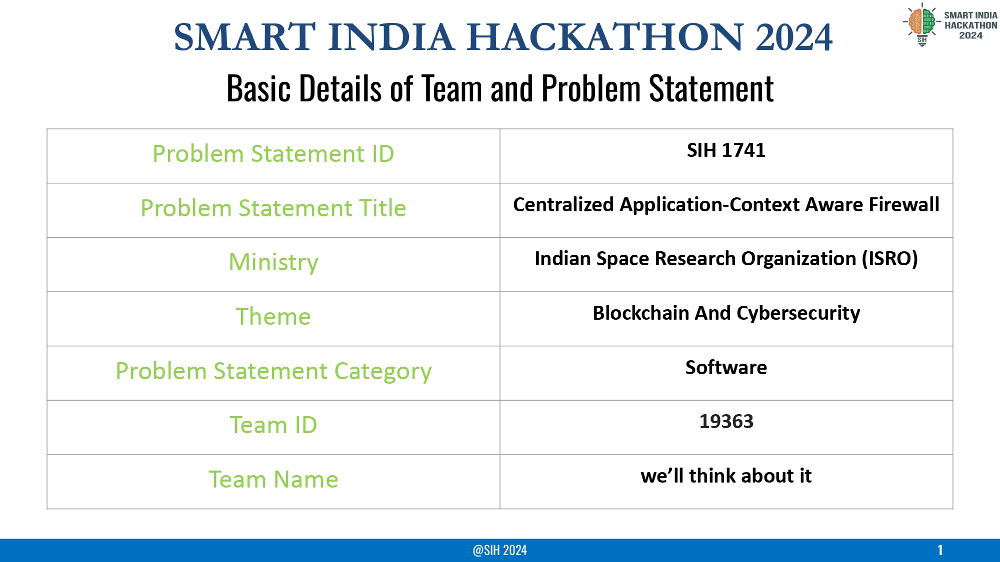
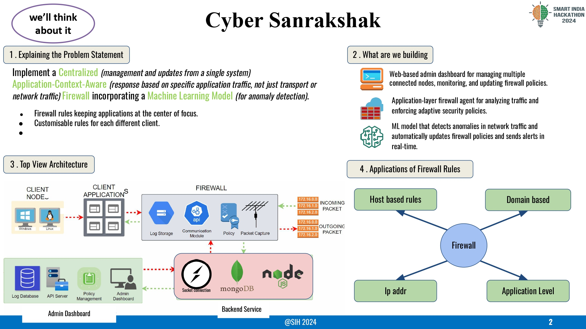
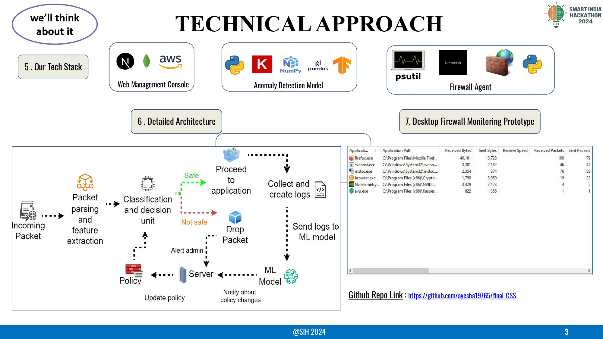
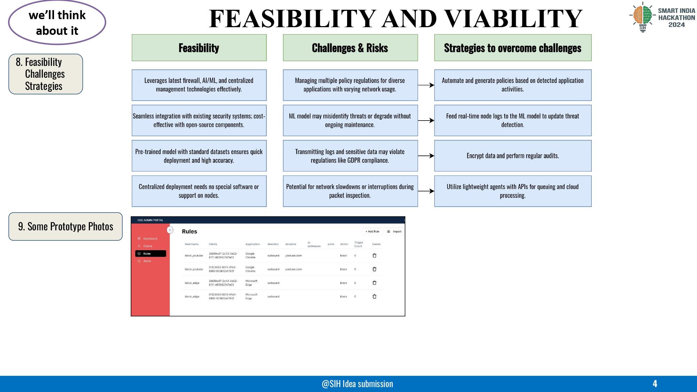
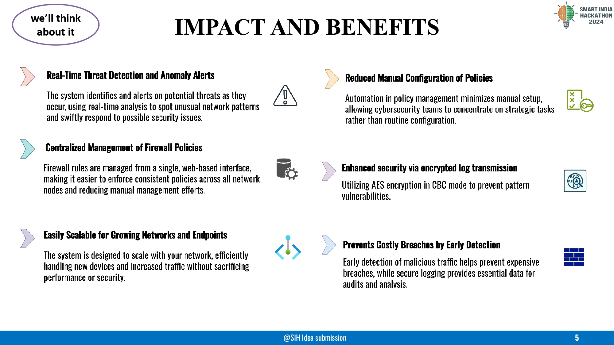
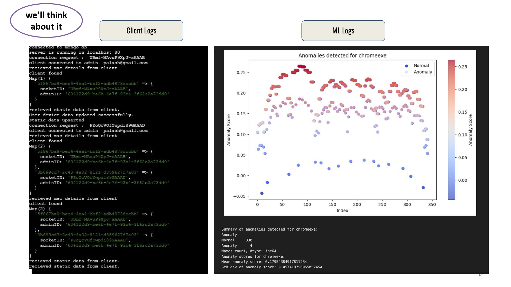
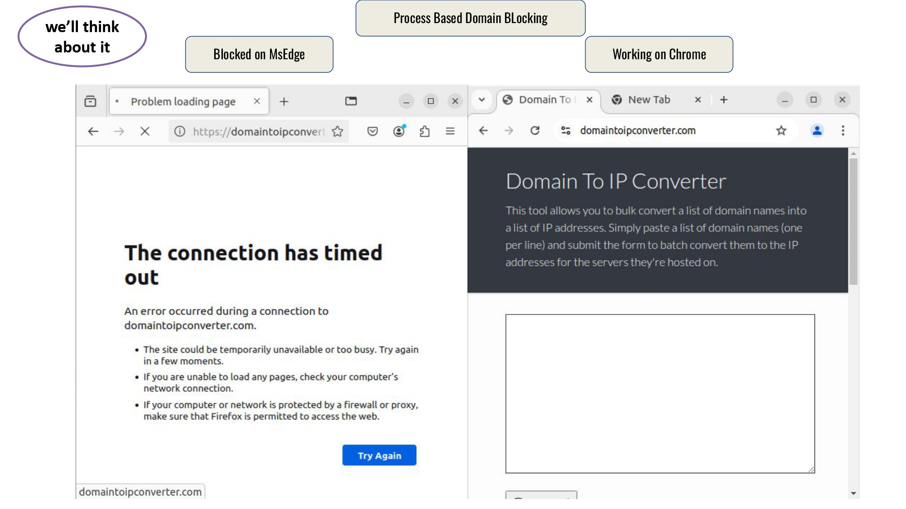

# Cyber Sanrakshak  

## Project Description:  

Cyber Sanrakshak is an advanced Context-Aware Firewall designed to enhance network security by leveraging machine learning and feature engineering. It provides administrators with a robust system to define, monitor, and enforce security rules based on domain, application, host, or IP-based attributes. The solution focuses on anomaly detection, enabling proactive threat prevention and a detailed log-based analysis for network behavior monitoring.  

## Overview:  
Cyber Sanrakshak was developed as part of the Smart India Hackathon 2024 to address challenges in network security management. The project provides a cross-platform firewall solution that integrates an admin dashboard, backend services, and a firewall agent for comprehensive monitoring and control.  

---

## Features:  

### **Firewall Rules:**  
- Domain-based filtering for enhanced content control.  
- Application-level monitoring and restriction.  
- Host and IP address-based rule enforcement.  

### **Anomaly Detection:**  
- Machine learning model to detect and prevent malicious behavior in real-time.  
- Proactive analysis based on client logs and system activity.  

### **Admin Dashboard:**  
- User-friendly interface for managing firewall rules and reviewing logs.  
- Dynamic visualization of network activity and security events.  

### **Monitoring Prototype:**  
- A desktop-based firewall monitoring tool to observe and control system activities.  

---

## Design Requirements:  

### **Architecture:**  
- **Top-Level Architecture:**  
  - Backend service for handling rule definitions and real-time monitoring.  
  - Socket connections for real-time updates between firewall agent and server.  

### **Tech Stack:**  
- Frontend: Next.js  
- Backend: Node.js  
- Database: MongoDB  
- Machine Learning: Python-based anomaly detection  

### **Responsiveness:**  
- The admin dashboard and monitoring tools are designed to work seamlessly across multiple devices.  

---
## PPT Slides:
To get a detailed walkthrough of the project, you can view the presentation slides:








## Local Setup:  

1. Clone both repositories:  
   - [Frontend Repository](https://github.com/ayesha19765/firewall-frontend/tree/1b2d9935a425f36e2322c00144f8249874e7fc98)  
   - [Backend Repository](https://github.com/Ayush-Vish/SIH-Context-Aware-Firewall/tree/7f6354c645c5bf2db38f1243208e6a68f0d0ee0f)  

2. Install dependencies:  
   ```bash
   cd firewall-frontend
   npm install
   cd ../firewall-backend
   npm install
   ```  

3. Start services:  
   - Run the backend:  
     ```bash
     node server.js
     ```  
   - Start the frontend:  
     ```bash
     npm start
     ```  

4. Access the dashboard at `http://localhost:3000`.  

---

## How to Use:  

1. **Login:** Access the admin dashboard with valid credentials.  
2. **Rule Management:** Add, modify, or delete firewall rules via the user-friendly interface.  
3. **Monitoring:** View real-time logs and statistics of network activity.  
4. **Anomaly Detection:** Automatically detect and handle suspicious activities using ML-powered insights.  

---

## Contributors:  
- **Palash Chitnavis**  
- **Ayush Sah IMT**  
- **Ankesh Gupta**  
- **Mahesh Suryawanshi**  
- **Ayush Vishwakarma**  
- **Ayesha**  

---

## Acknowledgments:  

This project was inspired by research and practical implementations in the field of anomaly detection and web application firewalls:  
- [Web Application Firewall Using Machine Learning and Feature Engineering](https://doi.org/10.1155/2022/5280158)  
- [Anomaly Detection Using Machine Learning Techniques](https://ieeexplore.ieee.org/document/9033532)  

By developing Cyber Sanrakshak, our goal is to provide a secure, scalable, and efficient solution for modern network security challenges.  

**Made with Love 🧡**  

©2024 Cyber Sanrakshak Team. All rights reserved.  
